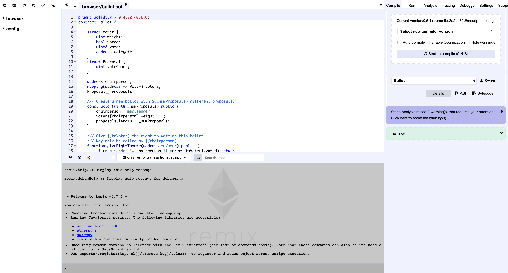

# eCommerce-hello-world

## Part I

#### Pre-requisites:

- Make sure you have Google Chrome Installed. If it is not installed, you can install it form here: [install Chrome](https://support.google.com/chrome/answer/95346?co=GENIE.Platform%3DDesktop&hl=en-GB).
- Some familiarity with programming, using GitHub, text-editor/IDE and terminal.

### TronLink

- If you do not have TronLink already installed, you will need to install it from the Chrome Web Store: [install TronLink](https://chrome.google.com/webstore/detail/tronlink/ibnejdfjmmkpcnlpebklmnkoeoihofec?hl=en-US).
- Once you have installed the TronLink extension, you should see it in the top right of your Chrome browser along with any other extensions you may have
- Click on the extension to set up your account:

  1. The TronLink popup will require you to create a password. Be sure to store this password as this is the easiest way to access your account. Follow the instructions provided and click on "Continue".
  2. You should see two options here: first to create a wallet and second to restore a wallet. Once you have created your wallet, you will be able to restore it by using your unique generated mnemonic or you private key. Both of these should be stored securely and privately as these can grant access to you account to anyone who knows them.
  3. Click on "Create wallet" to create a new wallet.
  4. TronLink will prompt you to create an account name. This is an easy way for you to distinguish accounts in your wallet instead of relying on the public key. Click on "Continue" after you have chosen an account name.
  5. You will be presented with a 12 word mnemonic. This is unique to your account and must be stored securely. Continue after you have stored this mnemonic.
  6. TronLink will now require you to select the words in your mnemonic in the order they were shown (top to bottom, one column at a time left to right).
  7. And that's it! You have created your TronLink wallet!

- **Though you wallet exists in your browser, it is not yet on the blockchain network.**
  1. In order to do so we need to do execute at least one transaction.
  2. Let us get your wallet on the Shastsa test network by obtaining some test TRX coins from Shasta faucet.
  3. Navigate to [Shasta Test Network](https://www.trongrid.io/shasta/) to learn more about it and get the test TRX.
  4. Scroll to the bottom of the page and you should see the prompt to enter you Test wallet address.
  5. Click on the TronLink extension to view your accounts.
  6. Navigate to the **Settings** tab in TronLink.
  7. You will see a section labeled Node selection. The **Mainnet** is the default selection. This is the main TRON network where you can explore and execute real, financially significant transactions after this tutorial!
  8. Select **Shasta Testnet** located right below the Mainnet selection. This is the test network provided by TRON for us to become familiar with the blockchain infrastructure and test ideas without any financial risk.
  9. Navigate back to the **Accounts** tab in TronLink. Here, you can switch between accounts. The one in _blue_ is the current account.
  10. Select and copy the account address below the account name. It will look something like this `TYLDyP6wJUTZ7tzKEDa3Ricicz2kAVtMEc`.
  11. This public address allows your account to interact with the blockchain. This is how users can send TRX to your account.
  12. Back on the [Shasta Test Network](https://www.trongrid.io/shasta/) page, paste your account address in the `Test wallet address` and click "Submit".
  13. you should see "Your request was successfully submitted, please check your wallet." right below the area you posted your account address.
  14. If you check your account in TronLink, you will see that your account has been sent 10,000 TRX! and you have 5,000 daily bandwidth points (_more on this later_).
  15. That's it, you are now ready to start interacting with and testing on the Shasta Test Network.
- You can view the [TronLink code on GitHub](https://github.com/TronLink/TronLink) if you would like to learn more about how it works.

### NPM

- Make sure you have NPM installed. You can install it by following instructions here: [install NPM](https://www.npmjs.com/get-npm).

### TronBox

- TronBox is a tool developed by the TRON team to help you compile and deploy your contracts quickly.
- Now that you have NPM installed, you can install TronBox globally on your machine by opening up your terminal and entering `npm install -g tronbox`.
- [TronBox GitHub](https://github.com/tronprotocol/tron-box).
- [TronBox Documentation](https://developers.tron.network/docs/tron-box-user-guide).

## Let's begin coding your first dApp on Tron!

### Set up the Project

1. Download or Clone the skeleton for this guide from [here](https://github.com/UjwalBattar/eCommerce-hello-world).
2. From your terminal, `cd` into this newly created directory.
3. In terminal, run `npm install`.
4. Open up this project in your favorite IDE/text-editor.

### Get Familiar with Application

1. Tour
2. Something

### Set up dotenv file

1. In the root directory of your project, create a file called `.env`
2. This file is used to store information you so not want to expose to the world
3. Open up this file and paste these lines

```
NODE_PATH='src/'
PK="enter/paste your private key here"
```

3. paste your private key in the `.env` file.
   1. To get your private key, click on the TronLink extension in Chrome.
   2. Make sure you are on the "Accounts" tab.
   3. Click on Export and you should see a pop-up display with your Private Key.
   4. copy and paste this key in your `.env` file.
4. Lastly, add `.env` in your `.gitignore` file if you plan on publishing this project on GitHub.

### Let us see TronLink and TronWeb in action

1. Launch the application by running `npm run start` in the terminal.
2. You should now see the application running in the browser.
3. In the browser, on the top right, you should see the "Account Information" section. This is the first part we will set up.

4. In your text-editor, navigate to the ./src/components/TronLinkInfo/index.js file.
5. Fetch Account Address:
   - Begin by uncommenting the `fetchAccountAddress` function (ln 26 - ln 36).
   - Now uncomment the function call on line 19 in the `componentDidMount` function.
   - If you go back to the browser, you should now see your account address displaying in Hex format.
   - If you would like to see this displayed in ASCii format, uncomment lines 29 to 32 and change the `setState` function on line 33 to look like:

```
this.setState({
accountAddress: accountAddressInASCii
});

```

- You should now be able to go to the browser and see your address displayed in ASCii format.
- You can click on the TronLink extension and verify that the address being displayed in ASCii format is indeed your account address.

4. Fetch Account Balance:
   - Similar to the previous function, uncomment the `fetchAccountBalance` function (ln 39 - ln 47).
   - Now uncomment the function call on line 20 in the `componentDidMount` function.
   - In the browser you should now see the balance of your account in SUN.
   - To view your account balance in TRX, uncomment line 41 and change the `setState` function on line 44 to look like:

```
this.setState({
  accountBalance: balanceInTRX
});
```

5. Fetch Account Bandwidth:
   - Uncomment the `fetchAccountBandwidth` function (ln 50 - ln 55).
   - Now uncomment the function call on line 21 in the `componentDidMount` function.
   - In the browser, you should now see the bandwidth balance of your account.

### Congratulations! You have completed the first part of this guide! In the next part, we will write out smart contract before moving on to connecting our front-end to our smart-contract on the blockchain!

---

## Part II

#### Overview

- In this part, we will explore the tools we use to build a smart contract.
- Smart contracts are essentially an efficient way to execute transparent and conflict-free transactions online without requiring services of third parties and middlemen.
- We will use a contract-oriented, high-level language for implementing smart contracts called Solidity. You can check out more in-depth information about Solidity in their documentation [here](https://solidity.readthedocs.io/en/v0.4.24/).
- We will also use [Remix](https://remix.ethereum.org/), a powerful, open source tool that helps you write Solidity contracts straight from the browser. built for Ethereum and written in JavaScript, Remix supports both usage in the browser and locally. Check out the documentation [here](https://remix.readthedocs.io/en/latest/).

Resources:

- [Remix](https://remix.ethereum.org/)
- [Remix Documentation](https://remix.readthedocs.io/en/latest/)
- [Remix Wikipedia](https://en.wikipedia.org/wiki/Remix)
- [Solidity Documentation](https://solidity.readthedocs.io/en/latest/#)
- [Solidity Wikipedia](https://en.wikipedia.org/wiki/Solidity)
- [BlockGeeks Smart Contract article](https://blockgeeks.com/guides/smart-contracts/)

Now that you have acquainted yourself with the tools, let us get started writing our first Smart Contract!

### Remix

#### Introduction

- First, navigate to [Remix](https://remix.ethereum.org/).
- The landing page for Remix will look like this:
  
- It comes pre-loaded with an example Ballot Contract. Feel free to look around and try to understand what is going on. Walkthrough: [Solidity by Example](https://solidity.readthedocs.io/en/v0.4.24/solidity-by-example.html).
- We will briefly go through some major parts of Remix complete tour can be found [here](https://remix.readthedocs.io/en/latest/solidity_editor.html).

  - The _file explorer_ section on the left will display all the files you have created in Remix. In the "browser" directory is where you will find the contracts you have created. 
  - The section in the middle is the _Editor_ or _RemixIDE_ where your contract files are compiled. This will also show open files and syntax highlighting mapped to Solidity keywords. 
  - Below the editor is the _Terminal_ which is helpful to view logs of transactions, interact with the RemixIDE and begin debugging. .
  - To the right, we will be focusing on 3 tabs - Compile, Run, and Testing but I urge you to learn more about all of them.
    - The _Compile_ tab is where we will select the compiler version we want Remix to use and also enable some settings to make the process easier on ourselves.
    - the _Run_ tab is where we will deploy and interact with our contract. We can also configure which environment we want Remix to connect to. We will stick with _JavaScript VM_ for now as the other two environments will require external tools. Web3 provider requires an Ethereum Node and Injected provider requires MetaMask or Mint. _MetaMask_ is similar to our _TronLink_ and injects _TronWeb_ which is comparable to _Web3_. 
    - The _Debugger_ tab is were we can walkthrough and debug our smart contract if we face some issues. (_More on this later_) 

#### Setup

1. Let us begin by creating a new contract file. (N.B. All Solidity files have a .sol extension)
   - In the top right, near the _file explorer_ section, click on the circle with a plus to create a new file.
   - You should see a pop up to alter the name of the default "Untitled.sol". You may call your file anything but note that it is a general rule of thumb to name it after the contract defined in it. Let us call this file "ECommerce.sol" as our contract will be called "ECommerce".
   - On successfully submitting the name, you should see your new, blank file (browser/ECommerce.sol) displayed in the _Editor_.
2. Compile tab:
   - In the dropdown that should currently be displaying _Select new compiler version_, scroll down the long list and select "0.4.25+commit.59dbf8f1". Currently, the max compiler version compatible with TRON is 0.4.25.
   - Above the dropdown, it should display "Current version:0.4.25+commit.59dbf8f1.Emscripten.clang"
   - Below the dropdown, we will also check the "Auto compile" box. This will recompile our Smart Contract on changes.
3. Run tab:
   - The Environment should be JavaScript VM
   - Account will have 5 test accounts with 100 Ether for testing within Remix. Note that the hash next to the "(100 Ether)" is the public address of that account, similar to your public address from TronLink. Right next to it is an option to copy the address of the currently selected account (_for future reference_).
   - The Gas limit will be defaulted to 3000000. We will leave this as is for now but you can learn more [here](https://masterthecrypto.com/ethereum-what-is-gas-gas-limit-gas-price/). This is similar to _Energy_ and _Bandwidth_ on _TRON_.
   - Value should be 0 and the denomination set to "Wei". you can learn more about Ethereum denominations [here](http://ethdocs.org/en/latest/ether.html). The denominations used on _TRON_ are _TRX_ or _SUN_.
   - After we get our contract working in Remix, we will make the necessary changes make it compatible with the TRON protocol.

#### Our Contract

---

## Part III
