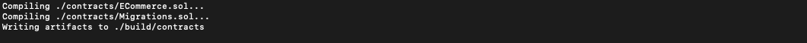

# eCommerce-hello-world

## Part I

#### Pre-requisites:

- Make sure you have Google Chrome Installed. If it is not installed, you can install it form here: [install Chrome](https://support.google.com/chrome/answer/95346?co=GENIE.Platform%3DDesktop&hl=en-GB).
- Some familiarity with programming, using GitHub, text-editor/IDE and terminal.

#### Overview

- In the 1st part of this tutorial we will get an introduction to the dApp we will build along with some tools and the TRON test network: Shasta.
- We will set up TronWeb, similar to Web3.js, which will be injected through TronLink and will allow us to interact with the protocol.
- We will create a TronLink account, access some test TRX, and interact with TronLink and the Shasta network via our dApp.

### TronLink

- If you do not have TronLink already installed, you will need to install it from the Chrome Web Store: [install TronLink](https://chrome.google.com/webstore/detail/tronlink/ibnejdfjmmkpcnlpebklmnkoeoihofec?hl=en-US).
- Once you have installed the TronLink extension, you should see it in the top right of your Chrome browser along with any other extensions you may have
- Click on the extension to set up your account:

  1. The TronLink popup will require you to create a password. Be sure to store this password as this is the easiest way to access TronLink. Follow the instructions provided and click on "Continue".
  2. You should see two options here: first to create an account and second to restore an account. Once you have created your wallet, you will be able to restore it in the future by using your unique generated mnemonic or you private key. Both of these should be stored securely and privately as these can grant access to you account to anyone who knows them.
  3. Click on "Create account" to create a new account.
  4. TronLink will prompt you to create an account name. This is an easy way for you to distinguish accounts in your wallet instead of relying on the public key. Click on "Continue" after you have chosen an account name.
  5. You will be presented with a 12 word mnemonic. This is unique to your account and must be stored securely. Continue after you have stored this mnemonic.
  6. TronLink will now require you to select the words in your mnemonic in the order they were shown (left to right and top to bottom, the same order it was displayed to you. As a word of caution, if there are repeated words, start over as it may cause some issues).
  7. And that's it! You have created your TronLink wallet!

- **Though you wallet exists in your browser, it is not yet on the blockchain network.**
  1. In order to do so we need to do execute at least one transaction.
  2. Let us get your wallet on the Shastsa test network by obtaining some test TRX coins from Shasta faucet.
  3. Navigate to [Shasta Test Network](https://www.trongrid.io/shasta/) to learn more about it and get the test TRX.
  4. Scroll to the bottom of the page and you should see the prompt to enter you Test wallet address.
  5. Click on the TronLink extension to view your accounts.
  6. Click on the settings gear icon at the top right of TronLink. The first options shold say _"Switch node"_. **Mainnet** is the default selection. This is the main TRON network where you can explore and execute real, financially significant transactions after this tutorial!
  7. If you click on it, you will be able to select **Shasta Testnet** located right below the Mainnet selection. This is the test network provided by TRON for us to become familiar with the blockchain infrastructure and test ideas without any financial risk. After selecting Shasta, exit back to the main screen of TronLink.
  8. You should also see your account, by name, in TronLink. Clicking here will open a tab that will allow you to switch between accounts, create new accuonts or restore accounts.
  9. Select and copy the account address below the account name. It will look something like this `TYLDyP6wJUTZ7tzKEDa3Ricicz2kAVtMEc`.
  10. This public address allows your account to interact with the blockchain. This is how users can send TRX to your account.
  11. Back on the [Shasta Test Network](https://www.trongrid.io/shasta/) page, paste your account address in the `Test wallet address` and click "Submit".
  12. you should see "Your request was successfully submitted, please check your wallet." right below the area you posted your account address.
  13. If you check your account in TronLink, you will see that your account has been sent 10,000 TRX! and you have 5,000 daily bandwidth points (_more on this later_).
  14. That's it, you are now ready to start interacting with and testing on the Shasta Test Network.
- You can view the [TronLink code on GitHub](https://github.com/TronLink/TronLink) if you would like to learn more about how it works.

### NPM

- Make sure you have NPM installed. You can install it by following instructions here: [install NPM](https://www.npmjs.com/get-npm). using NVM (Node Version Manager) is recommended, and directions can be found [here](https://medium.com/@Joachim8675309/installing-node-js-with-nvm-4dc469c977d9).

### TronBox

- TronBox is a tool developed by the TRON team to help you compile and deploy your contracts quickly.
- Now that you have NPM installed, you can install TronBox globally on your machine by opening up your terminal and entering `npm install -g tronbox`.
- [TronBox GitHub](https://github.com/tronprotocol/tron-box).
- [TronBox Documentation](https://developers.tron.network/docs/tron-box-user-guide).

## Let's begin coding your first dApp on Tron!

### Set up the Project

1. Download or Clone the skeleton for this guide from [here](https://github.com/TRON-US/eCommerce-hello-world).
2. From your terminal, `cd` into this newly created directory.
3. In terminal, run `npm install`.
4. Open up this project in your favorite IDE/text-editor.

### Get Familiar with Application

1. Tour
2. Something

### Set up dotenv file **IMPORTANT**

1. In the root directory of your project, create a file called `.env`
2. This file is used to store information you so not want to expose to the world
3. Open up this file and paste these lines

```javascript
PK = "enter or paste your private key here";
```

3. paste your private key in the `.env` file.
   1. To get your private key, click on the TronLink extension in Chrome.
   2. Make sure you are on the "Accounts" tab.
   3. Click on Export and you should see a pop-up display with your Private Key.
   4. copy and paste this key in your `.env` file.
4. Lastly, add `.env` in your `.gitignore` file if you plan on publishing this project on GitHub.

### Let us see TronLink and TronWeb in action

1. Launch the application by running `npm run start` in the terminal.
2. Your application should now be running in the browser window and look something like this: 
3. In the browser, on the top right, you should see the "Account Information" section. This is the first part we will set up.

4. In your text-editor, navigate to the ./src/components/TronLinkInfo/index.js file.
5. Fetch Account Address:
   - Begin by uncommenting the function call on line 19 in the `componentDidMount` function.
   - If you go back to the browser, you should now see your account address displaying in Hex format.
   - If you would like to see this displayed in Base58 format, uncomment lines 29 to 32 and change the `setState` function on line 33 to look like:

```javascript
this.setState({
  accountAddress: accountAddressInBase58
});
```

- You should now be able to go to the browser and see your address displayed in ASCii format.
- You can click on the TronLink extension and verify that the address being displayed in ASCii format is indeed your account address.

4. Fetch Account Balance:
   - Uncomment the function call on line 20 in the `componentDidMount` function.
   - In the browser you should now see the balance of your account in SUN.
   - To view your account balance in TRX, uncomment line 41 and change the `setState` function on line 44 to look like:

```javascript
this.setState({
  accountBalance: balanceInTRX
});
```

5. Fetch Account Bandwidth:
   - Uncomment the function call on line 21 in the `componentDidMount` function.
   - In the browser, you should now see the bandwidth balance of your account.
6. Your app should now look something like this:
   

### Congratulations! You have completed the first part of this guide! In the next part, we will write out smart contract before moving on to connecting our front-end to our smart-contract on the blockchain!

---

## Part II

#### Overview

- In this part, we will explore the tools we use to build a smart contract.
- Smart contracts are essentially an efficient way to execute transparent and conflict-free transactions online without requiring services of third parties and middlemen.
- We will use a contract-oriented, high-level language for implementing smart contracts called Solidity. You can check out more in-depth information about Solidity in their documentation [here](https://solidity.readthedocs.io/en/v0.4.24/).
- We will also use [Remix](https://remix.ethereum.org/), a powerful, open source tool that helps you write Solidity contracts straight from the browser. built for Ethereum and written in JavaScript, Remix supports both usage in the browser and locally. Check out the documentation [here](https://remix.readthedocs.io/en/latest/).

Resources:

- [Remix](https://remix.ethereum.org/)
- [Remix Documentation](https://remix.readthedocs.io/en/latest/)
- [Remix Wikipedia](https://en.wikipedia.org/wiki/Remix)
- [Solidity Documentation](https://solidity.readthedocs.io/en/latest/#)
- [Solidity Wikipedia](https://en.wikipedia.org/wiki/Solidity)
- [BlockGeeks Smart Contract article](https://blockgeeks.com/guides/smart-contracts/)

Now that you have acquainted yourself with the tools, let us get started writing our first Smart Contract!

### Remix

#### Introduction

- First, navigate to [Remix](https://remix.ethereum.org/).
- The landing page for Remix will look like this:
  
- It comes pre-loaded with an example Ballot Contract. Feel free to look around and try to understand what is going on. Walkthrough: [Solidity by Example](https://solidity.readthedocs.io/en/v0.4.24/solidity-by-example.html).
- We will briefly go through some major parts of Remix complete tour can be found [here](https://remix.readthedocs.io/en/latest/solidity_editor.html).

  - The **file explorer** section on the left will display all the files you have created in Remix. In the "browser" directory is where you will find the contracts you have created. 
  - The section in the middle is the **Editor** or **RemixIDE** where your contract files are compiled. This will also show open files and syntax highlighting mapped to Solidity keywords. 
  - Below the editor is the **Terminal** which is helpful to view logs of transactions, interact with the RemixIDE and begin debugging. 
  - To the right, we will be focusing on 3 tabs - Compile, Run, and Testing but I urge you to learn more about all of them.
    - The **Compile** tab is where we will select the compiler version we want Remix to use and also enable some settings to make the process easier on ourselves.
    - the **Run** tab is where we will deploy and interact with our contract. We can also configure which environment we want Remix to connect to. We will stick with **JavaScript VM** for now as the other two environments will require external tools. Web3 provider requires an Ethereum Node and Injected provider requires MetaMask or Mint. **MetaMask** is similar to our **TronLink** and injects **TronWeb** which is comparable to **Web3**. 
    - The **Debugger** tab is were we can walkthrough and debug our smart contract if we face some issues. (_More on this later_) 

#### Setup

1. Let us begin by creating a new contract file. (N.B. All Solidity files have a .sol extension)
   - In the top right, near the **file explorer** section, click on the circle with a plus to create a new file.
   - You should see a pop up to alter the name of the default "Untitled.sol". You may call your file anything but note that it is a general rule of thumb to name it after the contract defined in it. Let us call this file "ECommerce.sol" as our contract will be called "ECommerce".
   - On successfully submitting the name, you should see your new, blank file (browser/ECommerce.sol) displayed in the **Editor**.
2. Compile tab:
   - In the dropdown that should currently be displaying **Select new compiler version**, scroll down the long list and select "0.4.24+commit.e67f0147". Currently, the max compiler version compatible with TRON is 0.4.24.
   - Above the dropdown, it should display "Current version:0.4.24+commit.e67f0147.Emscripten.clang"
   - Below the dropdown, we will also check the "Auto compile" box. This will recompile our Smart Contract on changes.
3. Run tab:
   - The Environment should be JavaScript VM
   - Account will have 5 test accounts with 100 Ether for testing within Remix. Note that the hash next to the "(100 Ether)" is the public address of that account, similar to your public address from TronLink. Right next to it is an option to copy the address of the currently selected account (_for future reference_).
   - The Gas limit will be defaulted to 3000000. We will leave this as is for now but you can learn more [here](https://masterthecrypto.com/ethereum-what-is-gas-gas-limit-gas-price/). This is similar to **Energy** and **Bandwidth** on **TRON**.
   - Value should be 0 and the denomination set to "Wei". you can learn more about Ethereum denominations [here](http://ethdocs.org/en/latest/ether.html). The denominations used on **TRON** are **TRX** or **SUN**.
   - After we get our contract working in Remix, we will make the necessary changes make it compatible with the TRON protocol.

#### Our Contract

1. **Solidity Compiler Version:**

   - You should be seeing a yellow warning box to the right with this message: browser/ECommerce.sol:1:1: Warning: Source file does not specify required compiler version! Consider adding "pragma solidity ^0.5.1;"
   - If you have followed the instructions so far, you should have set the current compiler version to "0.4.24+commit.e67f0147". The error is being caused because our file is empty and does not specify the required compiler version. In our application, this version is specified in the `package.json` file as `"solc": "^0.4.24"`.
   - We can fix this by adding this to the first line of our contract: `pragma solidity ^0.4.23;`. The keyword `pragma` is used to specify which version of Solidity is used in our source file. The version specified here must be less than the version specified in the compile tab or the version used in the Compiler.

2. **Name our Contract:**

   - Add this block below version specification.

   ```solidity
    contract ECommerce {

    }
   ```

   - A `contract` is the type specification of `ECommerce` smart contract.
   - All of the contract methods will go between the two curly braces (`{}`).
   - On the right you should see a green box with `ECommerce` in it.
   - _Green_: You are on the right track! Keep going! (_Yellow_: Something is up. May be worth looking into, may be nothing. _Red_: Uh-oh! We need to go back and fix something. This is not going to compile.)

#### Everything below this will be done within the ECommerce contract.

3.  **Setting Up Variables**
    Solidity is a statically typed language so data types (string, uint, etc.) must be explicitly defined. You can learn more of the datatypes [here](https://solidity.readthedocs.io/en/v0.4.24/types.html).

    1.  Item struct:

        - A `struct` is how we define new data types in Solidity. As an e-Commerce store, we need items to sell. Let us define an `Item` struct within the ECommerce contract.

        ```solidity
        struct Item {

            }
        ```

        - Our `Item` data type will need some properties such as id, name, price, seller, buyer
        - Add the following to out Item struct:
          - `uint id;` (declare the **id** property as type _uint_)
          - `string name;` (declare the **name** property as type _string_)
          - `uint price;` (declare the **price** property as type _uint_)
          - `bool available;` (declare the **available** property as type _boolean_)
          - `address seller;` (declare the **seller** property as type _address_)
          - `address buyer;` (declare the **buyer** property as type _address_)
        - Your item struct should look like this now:

        ```solidity
        struct Item {
            uint id;
            string name;
            uint price;
            bool available;
            address seller;
            address buyer;
        }
        ```

    2.  Items mapping

        - A mapping is comparable to a hash table in many other languages. In solidity, it is virtually initialized in a way that every possible _key_ exists and map to a value whose byte-representation is all _zeros_. Learn more [here](https://solidity.readthedocs.io/en/v0.4.24/types.html).
        - Let us add `mapping (uint => Item) items;` below our Item struct. This will initialize an "empty" _mapping_ called _items_.
        - We will use a mapping to store our Item structs with the `id` as the _key_ and the `Item struct` as the _value_.
        - This is so we can keep track of and check if an item exists at an `id` before we add it to our store.
        - This also poses us with a small challenge:

          - We learned that all _keys_ are in "existence" when our map is initialized. Meaning that if we try to access an Item at a _key_ that we did not intentionally add, it will not return a null/nil/undefined in many other languages. It will return a **0**.
          - One approach to address this issue is to add a property "exists" to our Item struct. (`bool exists;`)
          - Our Item struct should now look like this:

          ```solidity
          struct Item {
              uint id;
              string name;
              uint price;
              bool available;
              address seller;
              address buyer;
              bool exists;
          }
          ```

          - Now, if we try to access an Item in the struct we can be sure by accessing the exists property of the Item struct and checking if it is `true`. (`items[id].exists == true`)

    3.  Total items

        - In order to make our lives easier, let us add a way to check the total number of Items in our items mapping.
        - Add `uint totalItems;` below the items mapping declaration.
        - `totalItems` currently has the value **0** as variables initialize with a default value of **0** in solidity.

4.  **Events**

    - According to the solidity docs, "Events allow the convenient usage of the EVM logging facilities, which in turn can be used to “call” JavaScript callbacks in the user interface of a dApp, which listen for these events." Learn more [here](https://solidity.readthedocs.io/en/v0.4.21/contracts.html#events).
    - Essentially, when we add items or buy items, we want to emit these events. Events will be provide useful data on the frontend of our dApp.
    - Events are specified with an `event` type followed by their name. In parentheses we specify the parameters an event will emit along with datatypes.
    - Add these two events below `totalItems`:

    ```solidity
    event Purchased(uint id, string name, address indexed seller, address indexed buyer, uint price);
    event Added(uint id, string name, uint price, address indexed seller, bool available, bool exists);
    event Total(uint totalItems);
    event Availability(bool available);
    ```

5.  **Constructor**

    - Constructors are used to initialize our contract and its variables with some default values.
    - Constructors are optional. If you do not need to initialize your contract with defaults, you may choose to not include a constructor in your contract.
    - We will use a constructor in our contract to ensure that `totalItems` is indeed set to zero when we initialize out contract.
    - Add this below `totalItems`:

    ```solidity
    constructor () public {
        totalItems = 0;
    }
    ```

    - A function can either be classified as private, public, internal or external:
      - Public: it can be accessed by all. This is the default for all functions.
      - Private: it can only be accessed within the contract.
      - Internal: Can only be accessed only by this contract and contracts deriving form it.
      - External: Cannot be accessed internally, _only_ externally.
    - A constructor should be labeled internal or public.

6.  **Contract Functions**
    Now that we have set up your contract, let us create some functions to actually interact with it.

    1. **checkItemsTotal** Checks how many items in the store.

       ```solidity
         function checkItemsTotal() public returns (uint total) {
             emit Total(totalItems);
             return totalItems;
         }
       ```

       - `public` anyone can call this.
       - `return` a uint, `totalItems` in the store/contract

    2. **addItem** Allow us to add items to our store.

       ```solidity
       function addItem (string _name, uint _price) public returns (bool success, uint id, string name, uint price, address seller, bool available) {
         }
       ```

       - `function` specifies that this is a function.
       - `addItem` is the name of our function.
       - `(string _name, uint _price)` are the input values (name, string) with their type specified (sting, uint). The underscore in Solidity is used to distinguish between global variables and function parameter.
       - `public` specifies that the function can be accessed by all.
       - Add the following to the addItem function:

         1. `uint itemId = totalItems;` Creates a unique id for each item based on totalItems in the store.
         2. Below are checks we can add to make sure that the item is not in the `items` mapping, using the exists property of the item, before we assign the same id to another item we add. We are also checking that the name is not empty (by converting the string to bytes and checking length) and the price is greater than 0.

         ```solidity
         require(!items[itemId].exists, "An item already exists at this ID.");
         require(bytes(_name).length > 0, "Item name cannot be empty.");
         require(_price > 0, "Price must be greater than zero (0).");
         ```


         3. `address sellerAddress = msg.sender;` Creates a variable `sellerAddress` with type `address` that we set using the `msg.sender` which exists on every every interaction a user has with the contract. This is the public address of the users account.
         4. Add the item to the mapping and assign it to the key `itemId`. This also assigns values to the properties of the Item.

         ```solidity
         items[itemId] = Item({
           id: itemId,                             // unique id for the item
           name: _name,                            // name of the item, passed in from the user as a parameter of the function
           available: true,                        // set to true (available) as it was just added to the store
           price: (_price * 1000000000000000000),  // price of the item converted to WEI, passed in from the user as a parameter
           seller: sellerAddress,                  // address of the person that added this item to the store
           buyer: 0,                               // set to 0 by default as nobody has bought the item
           exists: true                            // to allow checking if the item at an id exists in the mapping, set to true
         });
         ```

         5. `totalItems += 1;` updates the total items variable by one when we add the item.
         6. `emit Added(items[itemId].id, items[itemId].name, items[itemId].price, items[itemId].seller, items[itemId].available, items[itemId].exists);` emits the `Added` event upon successful adding of an item.
         7. `return (true, items[itemId].id, items[itemId].name, items[itemId].price, items[itemId].seller, items[itemId].available);` will return values that we can use on the frontend.

    3. **checkItem** allows the check an item from our contract before purchasing.
        ```solidity
        function checkItem(uint _id) public returns (uint itemId, string name, uint price, bool available,  address seller, address buyer, bool exists) {
          emit Availability(items[_id].available);
          return (items[_id].id, items[_id].name, items[_id].price, items[_id].available, items[_id].seller, items[_id].buyer, items[_id].exists);
        }
        ```
        1. Emits the `Availability` event.
        2. Returns specified values for our use.

    4. **buyItem** allows the purchase an item from our store.


        ```solidity
        function buyItem(uint _id) public payable returns (bool success, uint id, string name, address  seller, address  buyer, uint price) {
          require(items[_id].exists == true, "This item does not exist. Please check the id and try again.");
          require(items[_id].available == true, "This item is no longer available.");
          require(items[_id].seller != 0, "This item has no seller");
          require(items[_id].buyer == 0, "This item is no longer available");
          require(items[_id].price == msg.value, "Not enough TRX to buy this item.");

          address _buyerAddress = msg.sender;

          _handlePurchase(_id, _buyerAddress, msg.value);

          emit Purchased(_id, items[_id].name, items[_id].seller, items[_id].buyer, items[_id].price);

          return (true, _id, items[_id].name, items[_id].seller, items[_id].buyer, items[_id].price);

        }

        ```
        1. the function `buyItem` takes the `uint id` of the item being purchased.
        2. It is `public` (callable by anyone) and `payable` (allows function to receive tokens).
        3. On successful execution, it `returns` a `bool success`, the addresses of the `seller` and `buyer`.
        4. 5 `require` statements are checking to ensure that this is a valid transaction:
            - First, check if an item at this id exists.
            - Second, check if item is available.
            - Third, check that the item has a valid seller.
            - Fourth, check that the item currently has no buyer.
            - Fifth, check that the amount sent with the function is equal to the price of the item.
            - If any of these `require` statements fail, it will `revert` the transaction. Revert will cancel the transaction and return any __unused__ Ethereum: gas or TRON: energy/bandwidth.
        5. Set local variable `_buyerAddress` to `msg.sender`: the address of the person that called this function.
        6. Calls a contract function `_handlePurchase` to execute the purchase. We will write this next.
        7. Emits the `Purchased` event.
        8. Returns with the specified return parameters.

    5. **_handlePurchase** executes the actual purchase of the item.
        ```solidity
        function _handlePurchase(uint _id, address _buyerAddress, uint _value) internal {
          items[_id].available = false;
          items[_id].buyer = _buyerAddress;
          items[_id].seller.transfer(_value);
        }
        ```
        1. The function `_handlePurchase` is an `internal` (accessed by this contract) function. Internal function names are usually led by and underscore `_`.
        2. Sets the item's availability in the `items` mapping to `false`.
        3. Sets the item's buyer address to the `_buyerAddress` passed in.
        4. Transfers the tokens(`_value`) to the `seller` of the item.

#### That's it! Below we will check that our contract functions as expected in Remix before we move it to our application!

7. **Testing our contract in Remix**

   1. Go to the run tab on the right side. (Refer above for walkthrough of Remix)

      - Environment: should be set to JavaScriptVM.
      - Account: 5 default test accounts with 100 test Ether provided by Remix.
      - Gas limit: 3000000 (wei).
      - Value: 0 , wei.

   2. ECommerce should be selected in the next block right above the Deploy button.

      - Click the Deploy button.
      - You should see something similar to "ECommerce at 0xdc0...46222(memory)" in the deployed contracts block.
      - Click on this to see the contracts functions for us to test.

   3. Play around with each of the functions here to get a better understanding of what our contract is doing.

      - Check how many items are in the store. (`checkItemsTotal`)
      - Add an item to the store. (`addItem`)
      - Retrieve information about the item(s) you added using their id. (`checkItem`) This use an id of 0 if none is provided.
      - When using the `buyItem` function, be sure to change the Value above to match the **price of the item** which has been converted to wei. You can choose to change the denomination of the value or use the accurate amount in wei.
      - Use `checkItem` and check that the values of the bought items have changed.
      - Change the accounts above (between the 5 provided) and see the balances change on purchase.
      - Click the **Debugger** tab or the **Debug** button next to a transaction in the terminal and step through the functions.

### Congratulations! You have completed the second part of this guide and written your own smart contract! In the next section we will we will deploy our contract on the blockchain and tie it to our application!

## Part III

#### Overview

- In this final part of the guide, we will import our contract from Remix into our application and edit it to modify it to be suitable for the TRON network.
- We will compile and migrate our contract on the the Shasta test network using TronBox.
- Lastly, we will connect our smart contract to the front-end of our dApp so we can interact with it as any other website.

#### First,

- Let's make sure our terminal is open and you are in the project's root directory.
- Make sure that your dApp is open in your favorite IDE/text editor (Atom, VSCode, etc.).
- Refer to Part I if you have concerns about any of this.

### Importing Contract to dApp

- In your IDE, under the root folder, look for a directory labeled `contracts`. You should see a `Migrations.sol` file here already.
- Within this directory, create a file called `ECommerce.sol` and open this blank file.
- Copy your entire contract from Remix (from Part II) and paste it in this `ECommerce.sol` file.
- In the `addItem` function, change `price: (_price * 1000000000000000000),` to `price: (_price * 1000000),`. This is because 1 Ether is equal to 1e18 wei (1,000,000,000,000,000,000) where 1 TRX is equal to 1e6 Sun (1,000,000).
- Refer to the [`ECommerce.sol` file](https://github.com/TRON-US/eCommerce-hello-world/blob/master/Solution/ECommerce.sol) in the Solution folder for reference.

### Compiling & Migrating

Now that we have the smart contract in our application, we can go ahead and compile and migrate it.

1. In application, make the following changes to the migrations/2_deploy_contracts.js file:
   - Change line 1(`// var MyContract = artifacts.require("./MyContract.sol");`) to be `var ECommerce = artifacts.require("./ECommerce.sol");`.
   - Change line 4(`// deployer.deploy(MyContract);`) to be `deployer.deploy(ECommerce);`.
2. In the terminal, in the root of our dApp run `tronbox compile --compile-all`
   - the `--compile-all` flag calls all contracts to be compiled/recompiled.
   - This command will compile all the contracts you have in your application.
   - You should see an output similar to this:



3. Now run `tronbox migrate --network shasta` - This tells tronbox to use Shasta network, reset the network, and migrate the contracts onto the network.
   - If this is **NOT** the **first time migrating**, may need to use the `--reset` flag. Ex: `tronbox migrate --reset --network shasta`
   - Your output should look similar to this:


4. Be sure to grab the ECommerce contracts address provided by the previous command. You will see it in both base58 and hex formats. We only need one but you can store both just in case.
   - Head over to the **src/components/ECommerce/index.js** file in your text editor.
   - Near the top of the file, you will see a place to paste these addresses.

### Linking the Front-End of our dApp to our Smart Contract

1. Comment in all the commented out code.
2. Replace line 171 (`<p>This will be the ECommerce Component </p>`) with:

   ```html
   <div className="eCommerce-component-dash">
     <div>Total Items In Store: {totalItems}</div>
     <button onClick="{this.checkItemsTotal}">Total Contract Items</button>
     <button onClick="{this.addItem}">Add Item</button>
   </div>
   <div className="eCommerce-item-container">{allItems}</div>
   ```

   This also at the very bottom of the file.

3. If you need a reference to the code at any time, you can find the solution in [Solution/ECommerce-without-events.js](https://github.com/TRON-US/eCommerce-hello-world/blob/master/Solution/ECommerce-without-events.js)

#### Walkthrough of the Front-End

1. Lines 1 - 6:
   - We are importing React as this is a react application. Sweetalert will allow us to display custom alerts.
   - The utils file has functions to set tronweb and set the contract address.
   - eCommerceData is where we have stored our items in json format.

```JavaScript
import React, { Component } from "react";
import Swal from "sweetalert2";

import Utils from "../../utils";
import eCommerceData from "./eCommerce-data"; // items in json format
import "./ECommerce.scss"; //styling
```

2. Lines 8 - 12

   - This is where you can store your contract address which will be used in our application.

```JavaScript
/// Add your contract address here////////////////////////////////å
const contractAddress = "Your contract address here";
// base85v = "TLiXUGoitF1qPM6Z2c8g6fygiawoEyLXWL"
// hex = "4175e28fbf92bcd5afae462bb93a217f1ef3b9b2af"
/////////////////////////////////////////////////////////////////
```

3. Line 15 is standard React to implement a class component. In our case the class is ECommerce.

4. Lines 16 - 28
   - This is the constructor for our eCommerce class.
   - This is where we store component state and bind class functions to maintain context.

```JavaScript
constructor(props) {
  super(props);

  this.state = {
    dataLength: eCommerceData.length,
    allItems: [],
    totalItems: 0
  };

  this.addItem = this.addItem.bind(this);
  this.buyItem = this.buyItem.bind(this);
  this.checkItem = this.checkItem.bind(this);
  this.checkItemsTotal = this.checkItemsTotal.bind(this);
}
```

5. Lines 30 - 32
   - When component did mount, set tronweb and the contract from the address we provided above.

```JavaScript
async componentDidMount() {
  await Utils.setContract(window.tronWeb, contractAddress);
}
```

6. Lines 34 - 97 **addItem function**
   - We first extrapolate variables from the component state. and check to make sure that our json data has more items to add.
   - We create a price and assign it an id and random price.
   - We create the html for this item to be displayed in the browsed and push to the component state's items array.
   - We then call out contract's `addItem` function to add the item to the store. The return values from the return statements in our contract are then used to display an alert in our browser using sweetalert.
   - Finally we increment the total items in our component state.

```JavaScript
addItem() {
  const { totalItems, dataLength, allItems } = this.state;

  if (totalItems >= dataLength) {
    Swal({
      title: "No more items in data to add.",
      type: "error"
    });
    return;
  }

  let item = eCommerceData[totalItems];
  item.price = parseFloat(Math.random() * 10).toFixed(0);
  item.id = totalItems;

  allItems.push(
    <div className="eCommerce-item" key={item.id}>
      
      <div className="item-name">{item.name}</div>
      <div className="price-buy-container">
        <div className="item-price">{item.price} TRX</div>
        <button
          className="buy-button"
          onClick={() => this.buyItem(item.id, item.price)}
        >
          Buy
        </button>
        <button
          className="buy-button"
          onClick={() => this.checkItem(item.id)}
        >
          Check
        </button>
      </div>
    </div>
  );

  Utils.contract
    .addItem(item.name, item.price)
    .send({
      shouldPollResponse: true
    })
    .then(res => {
      Swal.fire({
        title: `${res.name} was added at index ${res.id}`,
        html:
          `<p>Price: ${res.price / 1000000} TRX (${res.price} SUN)</p>` +
          `<p>Seller: ${res.seller}</p>` +
          `<p>Available: ${res.available}</p>`,
        type: "success"
      });
    })
    .catch(err => {
      console.log(err);
      Swal.fire({
        title: "Unable to add item.",
        type: "error"
      });
    });

  this.setState({
    totalItems: totalItems + 1
  });
}
```

7. Lines 99 - 118
   - We call our contracts `checkItemsTotal` function and use the return values to display an alert in the browser. This will show our users the number of items in the store.

```JavaScript
checkItemsTotal() {
  Utils.contract
    .checkItemsTotal()
    .send({
      callValue: 0
    })
    .then(res => {
      Swal.fire({
        title: `There are ${res.total} in this contract's store.`,
        type: "success"
      });
    })
    .catch(err => {
      console.log(err);
      Swal.fire({
        title: "Something went wrong in checking the total.",
        type: "error"
      });
    });
}
```

8. Lines 120 - 140
   - We check the item at a given id to see its details in the contract and once again use the return values to display a useful alert for our user.

```JavaScript
checkItem(id) {
  Utils.contract
    .checkItem(id)
    .send({
      shouldPollResponse: true,
      callValue: 0
    })
    .then(res => {
      Swal.fire({
        title: `Available: ${res.available}.`,
        type: res.available ? "success" : "error"
      });
    })
    .catch(err => {
      console.log(err);
      Swal.fire({
        title: "Unable to check item.",
        type: "error"
      });
    });
}
```

9. Lines 142 - 164
   - We buy the item from our contract.
   - Notice that the call value is the price of the item multiplied by 1000000 to convert to SUN.

```JavaScript
buyItem(id, price) {
  Utils.contract
    .buyItem(id)
    .send({
      shouldPollResponse: true,
      callValue: price * 1000000 //convert to SUN
    })
    .then(res => {
      Swal.fire({
        title: `You have purchased ${res.name} for ${res.price /
          1000000} TRX (${res.price} SUN).`,
        html: `<p>Seller: ${res.seller}</p>` + `<p>Buyer: ${res.buyer}</p>`,
        type: "success"
      });
    })
    .catch(err => {
      console.log(err);
      Swal.fire({
        title: "Unable to purchase item.",
        type: "error"
      });
    });
}
```

10. Lines 166 - 179
    - Our component's render function which shows what to display in the browser.
    - Line 167: Extrapolate variables form component state.
    - Line 172: Button to check the total items in our contract.
    - Line 173: Button to add items.
    - Line 175: Where all our items will be displayed.

### Interacting with dApp and Smart-Contract from the Browser

- In the terminal, run `npm run start` and you should see the application in the browser.
- Feel free to click around and watch your application interact with your contract live on the Shasta network!
- Launching your application on to the internet is nothing different than launching any other React application. You can easily find resources online to help you through this.
- **CONGRATULATIONS! You have successfully built a dApp and launched a smart contract on the Shasta network! you are well on your way to become a successful dApp developer!**

### THINGS TO CONSIDER / EXPLORE:

- Here are some topics for you to explore on your own to make you a better dApp developer.
- If you refresh your page, your component will erase all the items but they will still exist in the contract. Why is this the case?
- Is the numeric id the safest way to interact with items?
- What other are some security risks associated with our contract? how can we solve them?
- Feel free to raise issues in the GitHub Repo or leave comments in the Medium article if you can think of more ways to improve this!

## Part IV

#### Overview

- In this part of the tutorial, we will explore events.
- We will build off of our existing contract and add event functionality to the fron-end.

Resources:

- [Solution/ECommerce-with-events.js](https://github.com/TRON-US/eCommerce-hello-world/blob/master/Solution/ECommerce-with-events.js).
- [TRON Developer Hub](https://developers.tron.network/).
- [TRON API Reference](https://developers.tron.network/reference).
- [Watch method in reference](https://developers.tron.network/reference#methodwatch).

### Events

- Events are an important part of smart contract development and can be used to track events when a contract is triggered.
- Similar to the `.call()` and `.send()` methods that we call on Contract methods, `.watch()` can be called on Contract Events.
  _Purchased_, _Added_, _Total_, and _Availability_.
- To begin, go ahead and grab all the code from [here](https://github.com/TRON-US/eCommerce-hello-world/blob/master/Solution/ECommerce-with-events.js) and replace the code in your **src/components/ECommerce/index.js** file.

#### Walkthrough of the Front-End with Events

Most of the front end is the same so we will only cover the lines that have changed.

1.  Line 28

    - Add this to your constructor function.

```JavaScript
this.startEventListeners = this.startEventListeners.bind(this);
```

2. Lines 33

- Add this to your `componentDidMount` function to invoke the `startEventListeners` when the React component mounts.

```JavaScript
this.startEventListeners();
```

3. Lines 36 - 76

   - Our `addItem` function no longer relies on the return statement to present data on the front end. Now we simply call the function.

```JavaScript
addItem() {
  const { totalItems, dataLength, allItems } = this.state;

  if (totalItems >= dataLength) {
    Swal({
      title: "No more items in data to add.",
      type: "error"
    });
    return;
  }

  let item = eCommerceData[totalItems];
  item.price = parseFloat(Math.random() * 10).toFixed(0);
  item.id = totalItems;

  allItems.push(
    <div className="eCommerce-item" key={item.id}>
      
      <div className="item-name">{item.name}</div>
      <div className="price-buy-container">
        <div className="item-price">{item.price} TRX</div>
        <button
          className="buy-button"
          onClick={() => this.buyItem(item.id, item.price)}
        >
          Buy
        </button>
        <button
          className="buy-button"
          onClick={() => this.checkItem(item.id)}
        >
          Check
        </button>
      </div>
    </div>
  );

  Utils.contract.addItem(item.name, item.price).send({
    shouldPollResponse: true
  });
}
```

4. Lines 78 - 93
   - Our `checkItemsTotal` function is now requires asynchronous functionality for events.
   - On Line 83, we call the `watch()` method on the `Utils.contract.Total()` event and store the awaited response in the variable `checkTotal`.
   - On line 90, we use `checkTotal.stop();` to stop watching the event as we no longer need to keep that connection open.

```JavaScript
async checkItemsTotal() {
  Utils.contract.checkItemsTotal().send({
    callValue: 0
  });

  let checkTotal = await Utils.contract.Total().watch((err, { result }) => {
    if (err) return console.log("Failed to bind event listener", err);
    if (result) {
      console.log(result);
      Swal.fire({
        title: `This contract has ${result.totalItems} items.`,
        type: "success"
      });
      checkTotal.stop();
    }
  });
}
```

5. Lines 95 - 112

- Similar to our `checkItemsTotal` function, we watch for the event to be emitted on our `checkItem` and then `stop()` watching after we receive the result.

```JavaScript
async checkItem(id) {
  Utils.contract.checkItem(id).send({
    callValue: 0
  });

  let checkAvailability = await Utils.contract
    .Availability()
    .watch((err, { result }) => {
      if (err) return console.log("Failed to bind event listener", err);
      if (result) {
        Swal.fire({
          title: `Available: ${result.available}.`,
          type: result.available ? "success" : "error"
        });
        checkAvailability.stop();
      }
    });
}
```

6. Lines 114 - 119
   - Without needing the return values, our `buyItem` function is much more concise. This is one of the added benefits of using `watch()`.

```JavaScript
buyItem(id, price) {
  Utils.contract.buyItem(id).send({
    shouldPollResponse: true,
    callValue: price * 1000000 // converted to SUN
  });
}
```

7. Lines 121 - 147
   - This is the one new function we have added to our code. This `startEventListeners` is responsible for watching the events emitted by our contract.
   - Umnlike the previous 2 functions, we may not want to call `stop()` after we use it as this will allow us to watch the contract to be notified of changes made by any other user.
   - In our case this is useful to be alerted when a new item has been added or an item has been purchased and no longer available.
   - We start 2 event listeners in this function to watch for the `Purchased` and `Added` events emitted by out contract.

```JavaScript
startEventListeners() {
  Utils.contract.Purchased().watch((err, { result }) => {
    if (err) return console.log("Failed to bind event listener", err);
    if (result) {
      Swal.fire({
        title: `${result.name} has been purchased for ${result.price}.`,
        html:
          `<p>Seller: ${result.seller}</p>` + `<p>Buyer: ${result.buyer}</p>`,
        type: "success"
      });
    }
  });

  Utils.contract.Added().watch((err, { result }) => {
    if (err) return console.log("Failed to bind event listener", err);
    if (result) {
      Swal.fire({
        title: `${result.name} has been added for ${result.price}.`,
        html:
          `<p>Seller: ${result.seller}</p>` +
          `<p>Added: ${result.exists}</p>` +
          `<p>Available: ${result.available}</p>`,
        type: "success"
      });
    }
  });
}
```

### Interacting with dApp and Smart-Contract from the Browser

- It is recommended to recompile and re-migrate your contract as not doing so may provide unpredictable results. Refer to the beginning of Part II for instructions. (If you are using the same contract as before, refresh you browser and try to check how many items are in the contract.)
- After migrating your contract, you will need to replace your contract address in the **components/ECommerce/index.js** file.
- In the terminal, run `npm run start` and you should see the application in the browser.
- Feel free to click around and watch your application interact with your contract live on the Shasta network!
- Launching your application on to the internet is nothing different than launching any other React application. You can easily find resources online to help you through this.

- **CONGRATULATIONS! You have successfully built a dApp and launched a smart contract with event listeners on the Shasta network!**

## Thank you for following this tutorial! Be on the look out for more educational resources from us in the future! See you around the network. TRON to the moon!

Be sure to follow TRON on our social media platforms and join our [discord](https://discord.gg/hrjr7P): https://discord.gg/hrjr7P channel to join and engage with our helpful, ever growing, and passionate community.
